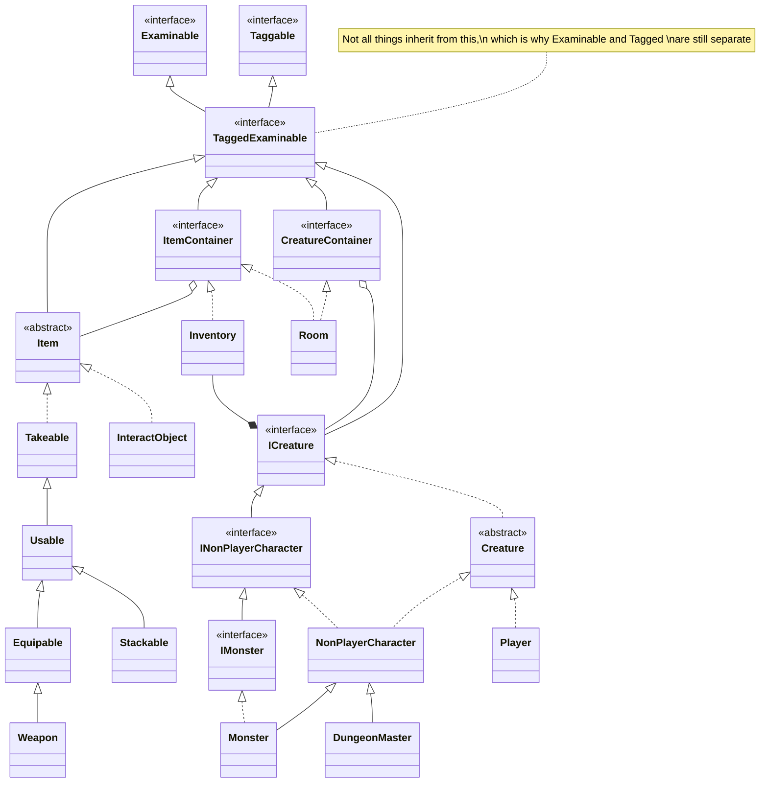

# LHF-MUD

Welcome to the `Low Hanging Fruit Multi-User Dungeon`!

This was once a group project at University. We had the opportunity to present ideas and form assigned groups around the idea, and this one was my idea! I wanted to make a multiplayer text-based adventure game, sometimes known as a [MUD or Multi-User Dungeon](https://en.wikipedia.org/wiki/Multi-user_dungeon). We did well academically, made our deadlines, graduated, etc. But I have continued to work on it occasionally, off and on again.

## Basic Gameplay

In a basic sense, the players go through the `Room`s of this `Dungeon` where they can interact with other `Player`s and `NonPlayerCharacter`s.  They will encounter `Monster`s who will fight the `Player`s, and the `Player`s can find loot as `Takeable` `Item`s!

### ASCII/Emoji Dungeon map with example

```
          +--------+
          |         |
          |   🧘    |
          |         |
+---------+---🏪---+
|         |         |
|   🤠   🚪     🛡️ |
|         |         |
+---------+---🚪---+
|         |         |
|🧰      🚪 👿 👿 |   
|         |         |
+---------+---------+
```

#### Example
Commands are preceeded by an arrow `>`.  Also note that normally, there is no graphic available, just text that describes the Room that the `Player` is in.

So the `Player` is on the left with the cowboy hat.  A `>SEE` command reveals that there is nothing in the room other than themselves, so they will `>GO EAST`.

In the next room, they find a `Shield`.  They decide that they want to use it, so they will `>TAKE Shield` and then `>EQUIP Shield`.  That will make them tougher.  They see doors to the north and south, so they decide to `>GO NORTH`.  

There they meet a `NonPlayerCharacter` named Jill.  The `Player` will `>SAY "Hi" to Jill`.  Jill tells him that there are violent goblins nearby, and asks the `Player` to get rid of them.  The `Player` agrees by `>SAY "Yes I will" to Jill`, and does `>GO SOUTH` twice.

In that room, the `Player` meets a pair of `Monster`s.  They battle it out with the `Player` using commands like `>ATTACK Goblin`. The battle ends and the `Player` emerges hurt, but victorious!  The `Player` finds a nice `Longsword` on one of the goblins with `>SEE "Goblin's corpse"`, so they `>TAKE Longsword from "Goblin's corpse"` and then `>EQUIP Longsword`. The `Player` sees another door and then does `>GO WEST`.

In the following room, they see a `Chest` and inside it is a `Healing Potion`.  They then `>TAKE "Healing Potion" from "Chest"` and `USE Healing Potion` to heal their wounds from the earlier fight.  

The `Player` can then navigate back to Jill and receive Experience Points and a Level for completing the quest.

# Mermaids




# Credits

Again, this was once a group project at University, where we were supposed to take on "real world" roles for this project.  

See our class wiki <https://github.com/cs428TAs/f2019/wiki/L.H.F.-M.U.D.>  page.

## The Team:

### Project Manager - [GeenDutchman](https://github.com/GeenDutchman)

* I come up with PBIs, keep track of tasks and generating reports, as well as hop in on the coding.

### Front-end Specialist - [dnajarro](https://github.com/dnajarro) 

* Create client interface and make sure client can communicate with the server.
* See [LHF-MUD-CLIENT](https://github.com/GeenDutchman/LHF-MUD-CLIENT)

### Director of Quality Assurance - [twthender](https://github.com/twthender) 

* Oversee official testing, log and track bugs and issues. Develop forms of automated testing.

### Architect - [KingArtisan](https://github.com/KingArtisan)

* Determine design choices, technical standards, and technical goals for the project. Ensure code reviews are happening, and that what's being produced matches our design. Make final technical decisions if disputes arise. Code where needed to help the team produce a quality product.

### Lead Gameplay Designer - Spencer

(Unfortunately, I couldn't confirm his profile for sure, sorry Man)
* Design and implement gameplay logic for the game server. Work alongside dungeon master to turn story ideas into implementation.

### Back End infastructor - [keeslinp](https://github.com/keeslinp)

* Build the infrastructure for the backend so that the client can connect and communicate in order to interact with the gameplay logic. I'm also handling the setup and deployment of the server.

### Lore/Dungeon Master - [despaink](https://github.com/despaink)
* World building, inputting creatures and objects in the database and general story line or lack there of :p