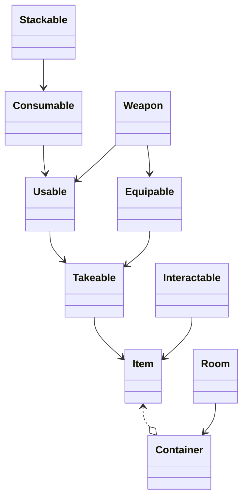

# LHF-MUD
School Project

See our class wiki <https://github.com/cs428TAs/f2019/wiki/L.H.F.-M.U.D.>  page.

# The Team:
* Drake Foltz (Project Manager) - I come up with PBIs, keep track of tasks and generating reports, as well as hop in on the coding.
* Daniel Najarro (Front-end Specialist) - Create client interface and make sure client can communicate with the server. 
* Tristan Henderson (Director of Quality Assurance) Oversee official testing, log and track bugs and issues. Develop forms of automated testing.
* Jonathan King (Architect) - Determine design choices, technical standards, and technical goals for the project. Ensure code reviews are happening, and that what's being produced matches our design. Make final technical decisions if disputes arise. Code where needed to help the team produce a quality product.
* Spencer Hastings (Lead Gameplay Designer) - Design and implement gameplay logic for the game server. Work alongside dungeon master to turn story ideas into implementation.
* Pearce Keesling (Back End infastructor) - Build the infrastructure for the backend so that the client can connect and communicate in order to interact with the gameplay logic. I'm also handling the setup and deployment of the server.
* Kendall Despain (Lore/Dungeon Master) - World building, inputting creatures and objects in the database and general story line or lack there of :p

**titles subject to change

# Mermaids

