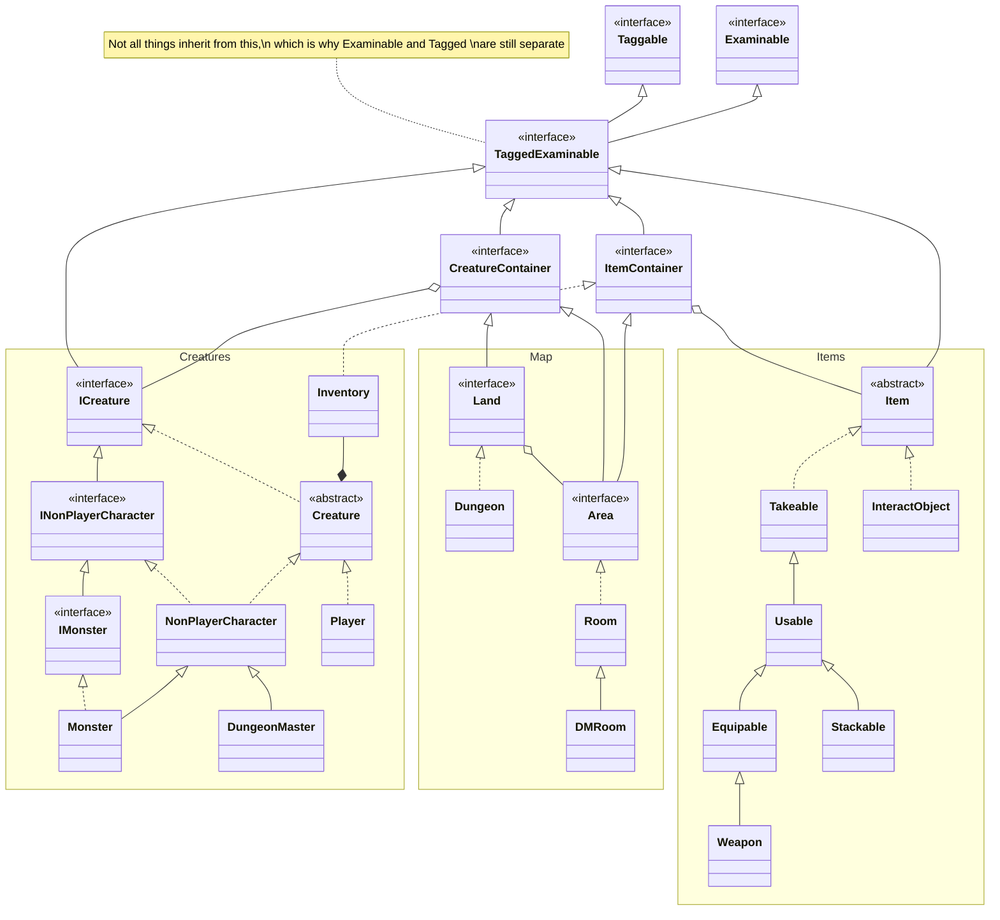
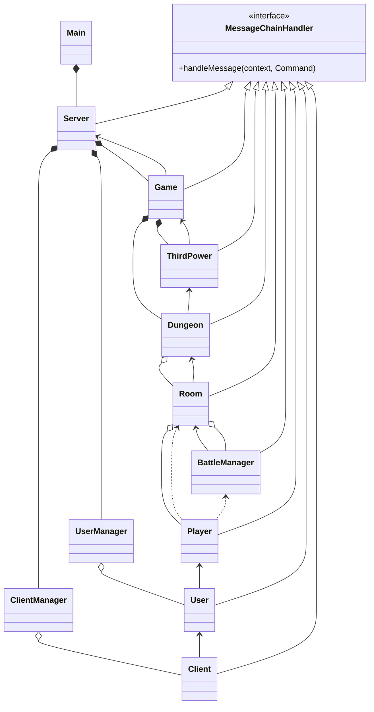
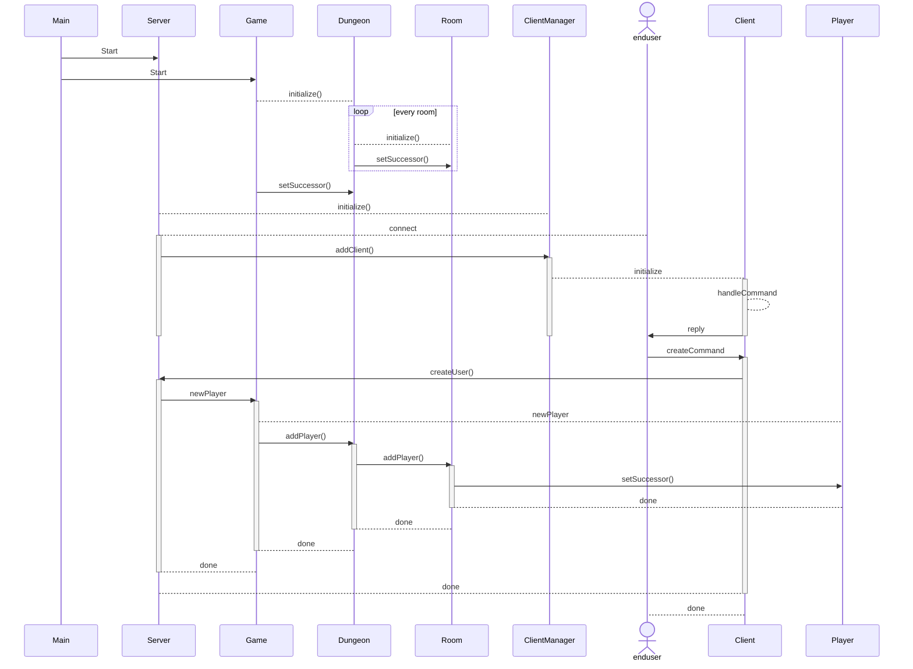

# Basic Structure

## More information

* [Dice](gameserver/src/main/java/com/lhf/game/dice/README.md) - one example of something `Taggable` but NOT `Examinable`

# Server Design

## Chain of Command

### More information

* [Magic](./game/magic/README.md) - what the `ThirdPower` is all about
* [AI](./game/creature/intelligence/README.md) - The `NonPlayerCharacter`s artificial intelligence

## Sequence Diagram of Commands

### More Information

* [Commands](./messages/README.md)
* [Out Messages](./messages/out/README.md)
