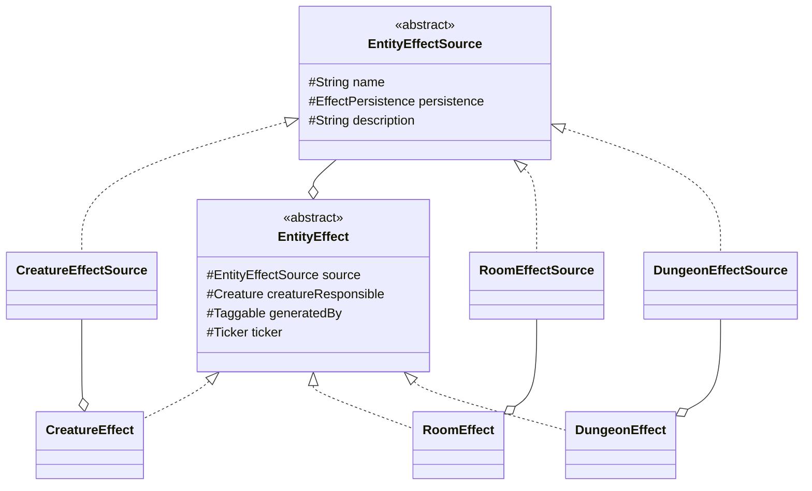

# Effects

* [Spells](./magic/README.md)

```mermaid
classDiagram
    direction TB
    class EntityEffectSource {
        <<abstract>>
        #String name
        #EffectPersistence persistence
        #String description
    }
    class EntityEffect {
        <<abstract>>
        #EntityEffectSource source
        #Creature creatureResponsible
        #Taggable generatedBy
        #Ticker ticker
    }
    class CreatureEffectSource
    class RoomEffectSource
    class DungeonEffectSource

    class CreatureEffect
    class RoomEffect
    class DungeonEffect

    EntityEffectSource <|.. CreatureEffectSource
    EntityEffectSource --o EntityEffect
    EntityEffectSource <|.. RoomEffectSource
    EntityEffectSource <|.. DungeonEffectSource

    EntityEffect <|.. CreatureEffect
    EntityEffect <|.. RoomEffect
    EntityEffect <|.. DungeonEffect

    CreatureEffectSource --o CreatureEffect
    RoomEffectSource --o RoomEffect
    DungeonEffectSource --o DungeonEffect

```
