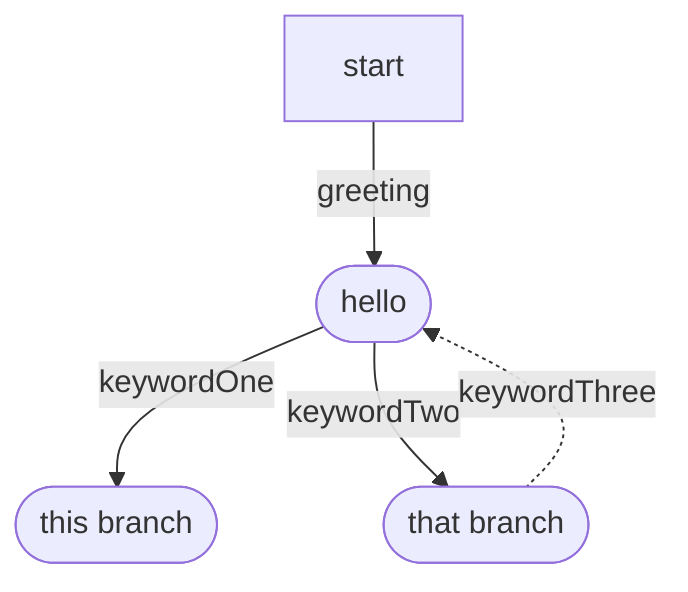
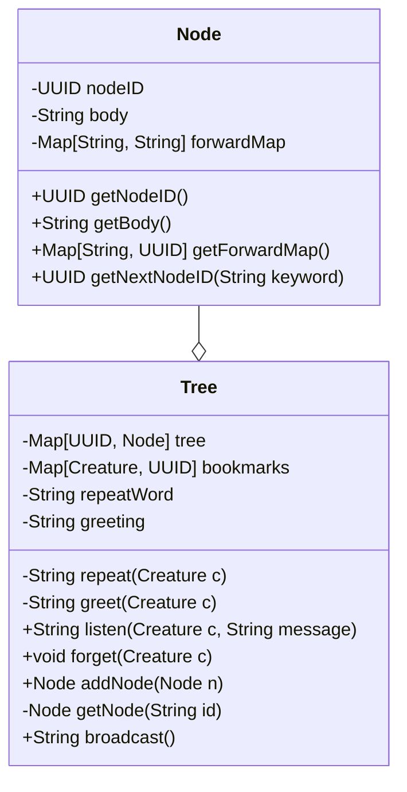

## Basics

The first thing is that we need a sort of tree structure, potentially a DAG.

When the conversation goes off an end, then we can set up a mechanism to go back to the start node (so thus not a DAG).

So at the very least, each `node` of conversation should have some sort of `body` of text.  That `body` should contain or hint at (tag?) key words that can direct the conversation to a new `node`.

The `tree` of `node`s should maintain some sort of bookmark indicating which `node` of the conversation a `creature` is currently at.  The `tree` should maintain what greeting is used to start the conversation.  It should also maintain a specific keyword to repeat the current `node`'s `body`.

Optionally, the `NPC` could "forget" about where a `creature` is in the conversation when the `creature` leaves the `room`.  And the `NPC` can potentially broadcast the greeting when a `creature` enters the room.

## Implementation

