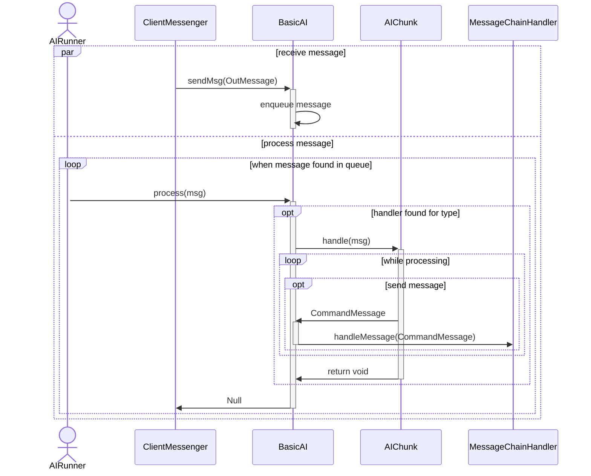

# Intelligence

Creatures that are not Players should be able to take actions as well.  This package will let a basic ai control their actions.  Most of these actions are reactive to messages that come in.

## AIRunner

The AIRunner interface allows for a separate thread to handle the processing of messages, rather than the main thread.  You can stop it and check if it is stopped.  You can queue up attention and register an NPC with it.

### GroupAIRunner

A queued implementation of an AIRunner.

## Conversation

* [Conversation](../conversation/README.md)

## BasicAI

### Battle

During a fight, the BasicAI does its best to keep track of statistics about the battle, mainly who AGGRO-ed it the most recently and how much damage individual participants have dealt.

It should consider, in order of most dumb enemies to more intelligent, the following actions:

- Attacking Random Pick from Enemies
- Attacking Who holds the aggro record
- Fleeing when own health is low (Bucketed)
- Enemy health (Bucketed)
- Enemy Vocation
- Offensive Spells to use agaisnt Enemies
- Support Spells for self
- Support Spells for allies

For each thing that process the battle stats (in parallel) it should return a mapping of command (`InMessage`) to score (`float`).  The score should be in the range of zero to one.  Each of those processors would be associated with a `float` multiplier, also between zero and one. The multiplier will be applied to each score produced by that processor.  These maps are blended, and then a command (or set of commands) is picked from the highest scoreing actions and then executed.  Should that fail, then then attacking a random enemy in melee will be the fallback.

So this can be broken into two steps, picking an action, and if need be, picking a target.

Actions:

- Attack
- Cast
- Go
- Pass
- (additional actions as appropriate)

#### Attack

Attack needs to select a target.  Only creatures listed in `BattleMemories` will be considered. Then those creatures will be filtered down to leave only those in opposing factions (Enemies).  If there are no opposing creatures and the battle is still somehow running, then the controlled creature will have a choice of either "Pass" or "Go".

##### Targeting

Anything recorded in the `BattleMemories` can be used to select an enemy to target.
The following criteria will be used normally to select an opposing creature to target:

- Randomized
- Aggro highwater mark
- Aggro memory record
- Enemy health (bucketed)
  - Usually selecting by whoever is weakest
- Enemy vocation
  - Usually attack order would go `HEALER`, `MAGE`, and then `FIGHTER`

Using the default weapon for the creature should suffice.

#### Cast

Casting has the difficulty of picking *which* spell to cast, as well as what, if anything, to target with that spell.  A `DUNGEON_MASTER` or `MAGE` will mostly focus on offensive spells.  A `HEALER` would most likely focus on not offensive spells.  
There is also the special case of AoE spells, in which very little target selection is needed.

##### Offensive

An offensive spell should probably follow the same criteria as [attack targeting](#targeting).

##### Not Offensive

For this, the `BattleMemories` should be filtered by Allies, or at least not Enemies.  The criteria are simpler here: If someone is hurt (for some value of hurt) and healing spells are available, heal them.  Else if no healing spells are available, try using a buff spell on the injured target.  If neither of those is the case, then try for just using a buff spell on someone.  Else, maybe try a summoning spell?

#### Go

Fleeing is discouraged during a battle, both for the Players as for the AIs.  So the available directions are not visible during a fight.  AIs should only attempt to flee at a provided health bucket, and only if they have an appreciable intelligence score.

The code should pick randomly between the 4 most common directions, with a slight chance for the others.  If the creature fails to flee, that is its turn.

#### Pass

Passing should happen only if no enemies are detected, and somehow the battle is still going.

### Peace

When not in battle, most AIs should do nothing except reply to conversation, or wait to be attacked.  In the case of Monsters, there is a choice between attacking Players on entry, vs waiting to be attacked.

Special roving creatures should wait for some random amount of time, and then pick a random direction to travel.

Summoned creatures or creatures in a swarm should have another creature that they will follow.
