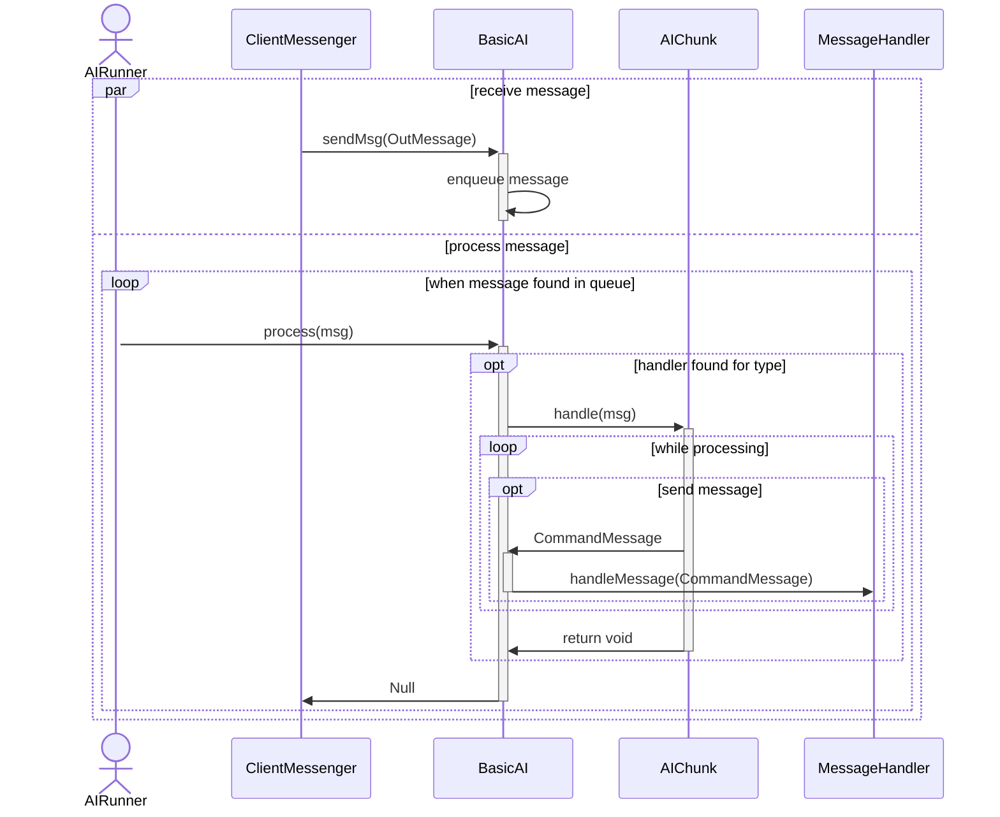

# Intelligence

Creatures that are not Players should be able to take actions as well.  This package will let a basic ai control their actions.  Most of these actions are reactive to messages that come in.

## AIRunner

The AIRunner interface allows for a separate thread to handle the processing of messages, rather than the main thread.  You can stop it and check if it is stopped.  You can queue up attention and register an NPC with it.

### GroupAIRunner

A queued implementation of an AIRunner.

## BasicAI

### Battle

During a fight, the BasicAI does its best to keep track of statistics about the battle, mainly who AGGRO-ed it the most recently and how much damage individual participants have dealt.

It should consider, in order of most dumb enemies to more intelligent, the following actions:

 - Attacking Random Pick from Enemies
 - Attacking Who holds the aggro record
 - Fleeing when own health is low (Bucketed)
 - Enemy health (Bucketed)
 - Enemy Vocation
 - Offensive Spells to use agaisnt Enemies
 - Support Spells for self
 - Support Spells for allies

For each thing that process the battle stats (in parallel) it should return a mapping of command (`InMessage`) to score (`float`).  The score should be in the range of zero to one.  Each of those processors would be associated with a `float` multiplier, also between zero and one. The multiplier will be applied to each score produced by that processor.  These maps are blended, and then a command (or set of commands) is picked from the highest scoreing actions and then executed.  Should that fail, then then attacking a random enemy in melee will be the fallback.

