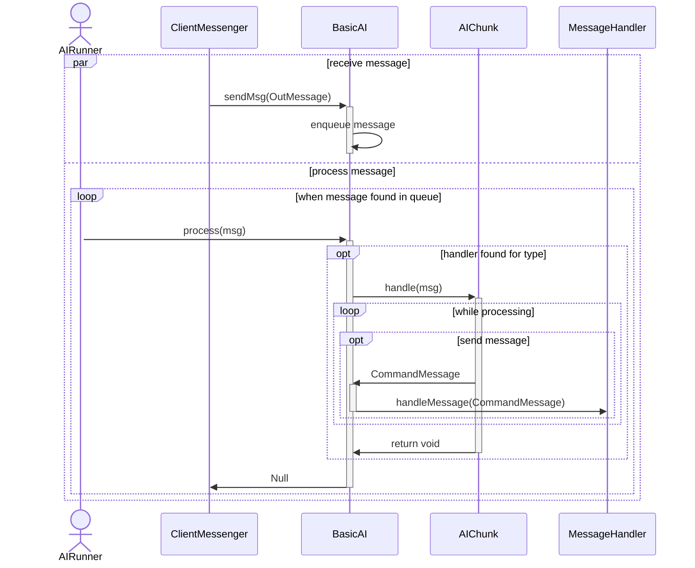

# Intelligence

Creatures that are not Players should be able to take actions as well.  This package will let a basic ai control their actions.  Most of these actions are reactive to messages that come in.

## AIRunner

The AIRunner interface allows for a separate thread to handle the processing of messages, rather than the main thread.  You can stop it and check if it is stopped.  You can queue up attention and register an NPC with it.

### GroupAIRunner

A queued implementation of an AIRunner.

