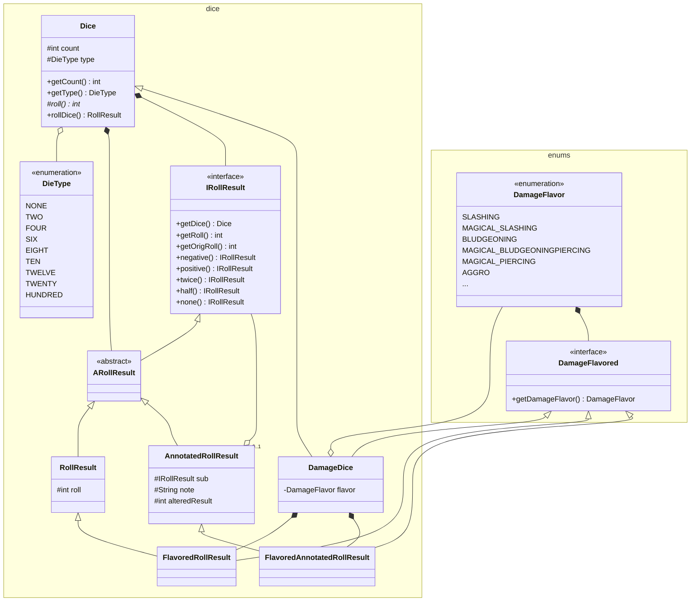

# Dice

```mermaid
classDiagram
    direction TD
    namespace dice {
        class Dice {
            #int count
            #DieType type
            +getCount() int
            +getType() DieType
            #roll() int*
            +rollDice() RollResult
        }
        class DieType {
            <<enumeration>>
            NONE
            TWO
            FOUR
            SIX
            EIGHT
            TEN
            TWELVE
            TWENTY
            HUNDRED
        }
        class IRollResult {
            <<interface>>
            +getDice() Dice
            +getRoll() int
            +getOrigRoll() int
            +negative() IRollResult
            +positive() IRollResult
            +twice() IRollResult
            +half() IRollResult
            +none() IRollResult
        }
        class ARollResult {
            <<abstract>>
        }

        class RollResult {
            #int roll
        }

        class AnnotatedRollResult {
            #IRollResult sub
            #String note
            #int alteredResult
        }

        class DamageDice {
            -DamageFlavor flavor
        }

        class FlavoredRollResult
        class FlavoredAnnotatedRollResult
    }
    Dice o-- DieType
    Dice *-- ARollResult
    Dice *-- IRollResult
    IRollResult <|-- ARollResult
    %% Dice *-- AnnotatedRollResult
    Dice <|-- DamageDice


    DamageDice *-- FlavoredRollResult
    AnnotatedRollResult <|-- FlavoredAnnotatedRollResult
    DamageDice *-- FlavoredAnnotatedRollResult

    ARollResult <|-- RollResult


    RollResult <|-- FlavoredRollResult

    IRollResult --o "0..1" AnnotatedRollResult
    ARollResult <|-- AnnotatedRollResult

    namespace enums {
        class DamageFlavor {
            <<enumeration>>
            SLASHING
            MAGICAL_SLASHING
            BLUDGEONING
            MAGICAL_BLUDGEONINGPIERCING
            MAGICAL_PIERCING
            AGGRO
            ...
        }
        class DamageFlavored {
            <<interface>>
            +getDamageFlavor() DamageFlavor
        }
    }

    DamageFlavor --o DamageDice
    DamageFlavored <|-- DamageDice
    DamageFlavored <|-- FlavoredRollResult
    DamageFlavored <|-- FlavoredAnnotatedRollResult

    DamageFlavor *-- DamageFlavored
```