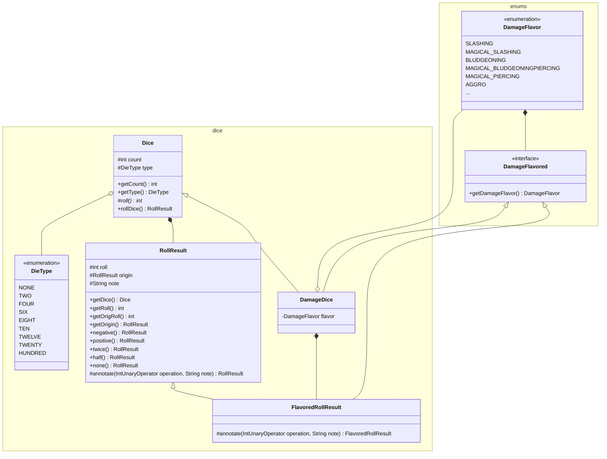

# Dice

```mermaid
classDiagram
    direction TD
    namespace dice {
        class Dice {
            #int count
            #DieType type
            +getCount() int
            +getType() DieType
            #roll() int*
            +rollDice() RollResult
        }
        class DieType {
            <<enumeration>>
            NONE
            TWO
            FOUR
            SIX
            EIGHT
            TEN
            TWELVE
            TWENTY
            HUNDRED
        }
        class RollResult {
            #int roll
            #RollResult origin
            #String note
            +getDice() Dice
            +getRoll() int
            +getOrigRoll() int
            +getOrigin() RollResult
            +negative() RollResult
            +positive() RollResult
            +twice() RollResult
            +half() RollResult
            +none() RollResult
            #annotate(IntUnaryOperator operation, String note) RollResult
        }


        class DamageDice {
            -DamageFlavor flavor
        }


        class FlavoredRollResult {
            #annotate(IntUnaryOperator operation, String note) FlavoredRollResult
        }
    }
    Dice o-- DieType
    Dice *-- RollResult
    Dice <|-- DamageDice


    DamageDice *-- FlavoredRollResult

    RollResult <|-- FlavoredRollResult


    namespace enums {
        class DamageFlavor {
            <<enumeration>>
            SLASHING
            MAGICAL_SLASHING
            BLUDGEONING
            MAGICAL_BLUDGEONINGPIERCING
            MAGICAL_PIERCING
            AGGRO
            ...
        }
        class DamageFlavored {
            <<interface>>
            +getDamageFlavor() DamageFlavor
        }
    }

    DamageFlavor --o DamageDice
    DamageFlavored <|-- DamageDice
    DamageFlavored <|-- FlavoredRollResult


    DamageFlavor *-- DamageFlavored
```
