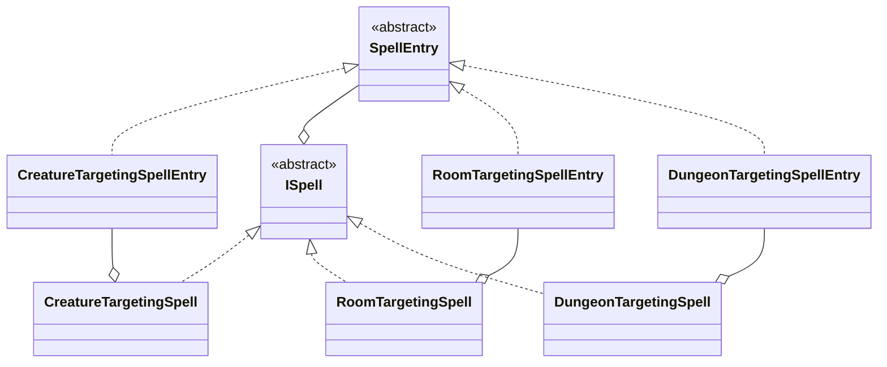
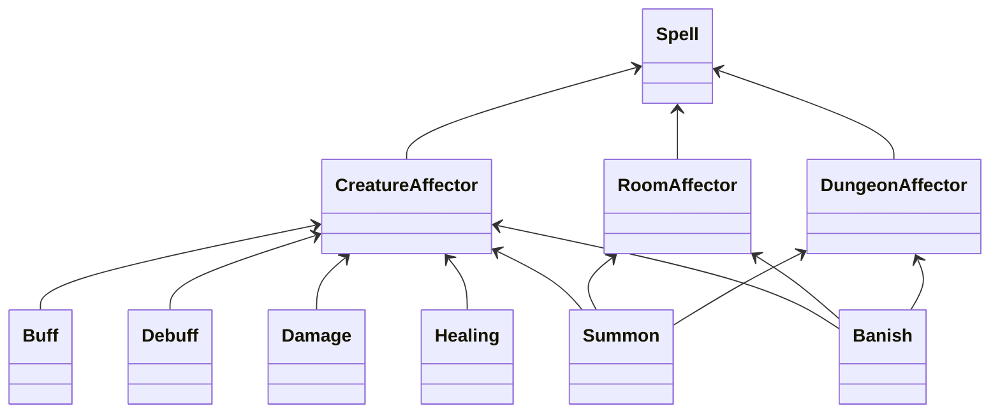

* [Effects](../README.md)

spells can buff
spells can debuff
spells can damage
spells can heal
spells can summon
spells can banish

spells can require caster ability check
spells can have caster spell DC
spells can require target ability save
spells can require target AC

For casting a spell:
have ability to cast spells
have energy to cast spells
need to invoke spell
-> make caster check
-> provide caster DC
-> target save
-> target too tough
apply effect to target

third power:
|onCast(cubeholder, castCommand) -> Spell:
||spell = SpellBuilder.invoke(castCommand)
||castLevel = spell.getCastingLevel()
||if not cubeholder.hasCastingPower(castLevel):
|||flub = this.createFlub(castLevel)
|||spell.addEffect(flub)
|||spell.addTarget(cubeholder)
|||return spell
||for target in castCommand:
|||spell.addTarget(target)
||for target in this.getRoomOccupants():
|||spell.addTarget(target)
||return spell

onCast():
	if creature is caster:
		if invokeSpell():
			if have energy for level:
				if spell needs check:
					provide check
				if spell needs DC:
					provide DC
				return spell
		return flub
	return watdoje?

onSpell():
	if spell has target:
		if DC provided and target save(dc):
			return noaffect
		if check provided and target too tough(check):
			return noaffect
	apply effects to target
    

### old

