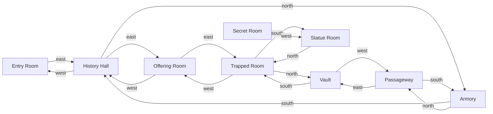

# Standard Map

rooms listed by number, adjacent rooms are connected in some way

```
x | x | 7 | x |
x | 6 | x | 8 |
1 | 2 | 3 | 4 |
x | x | x | 5 | Secret room
``````

1. entry hall
2. history room
3. offering room
4. trapped hall
5. statue room
6. armory

or mermaided


