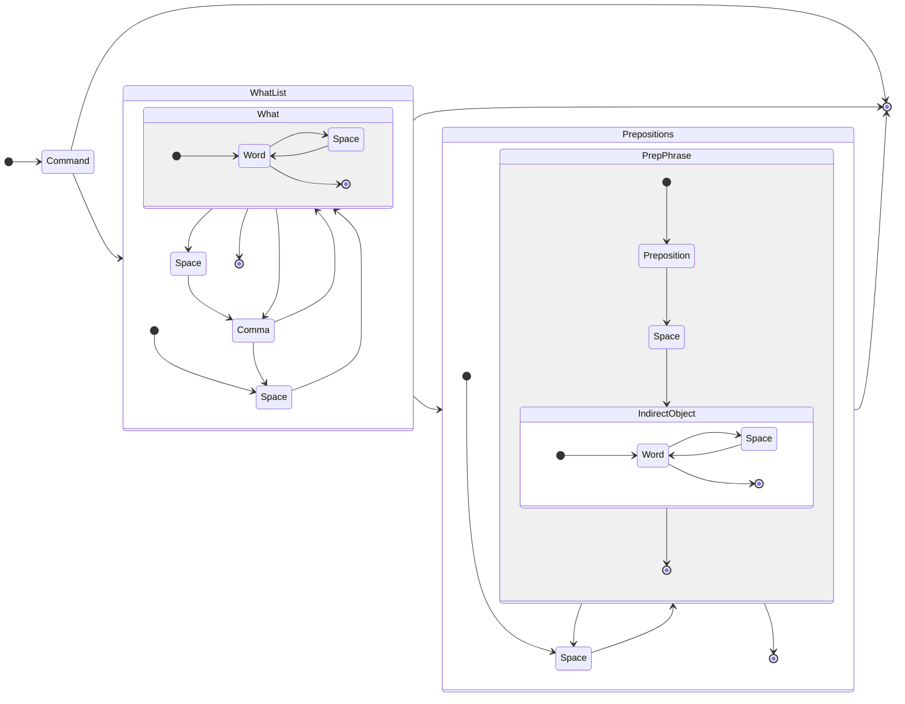

## Full definition

## Tokens

- any word
- any character that's not a space
- any space

## Examples

### Attack

- attack goblin
- attack goblin with sword
- attack "boblin the goblin"
- attack "boblin the goblin" with sword
- attack "boblin the goblin", "morc the orc"
- attack "boblin the goblin", "morc the orc" with sword
- attack "boblin the goblin", "boblin the goblin"
- attack "boblin the goblin", "boblin the goblin" with sword
- attack boblin the goblin with sword
- attack boblin the goblin, morc the orc with sword
- ~~attack boblin with eyes with sword~~
- ~~attack goblin with with sword~~
- ~~attack goblin with sword with bow~~
- attack "goblin with eyes"
- attack "goblin with eyes" with sword