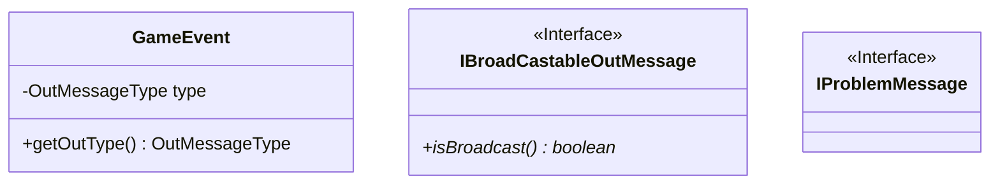

# Messages

Messages usually have to do with a Creature, an Item, a Command, Lewdness, Battle, Spells, Effects, or a group.

Messages could be broadcastable.
The subject matter should be easily retrivable by type and name.
Some messages relay errors about the subject matter.

GameEvent.java

## Problem messages

BadFatalEvent.java
BadGoEvent.java
BadMessageEvent.java
BadSpeakingTargetEvent.java
BadTargetSelectedEvent.java
BadUserDuplicationEvent.java
HelpNeededEvent.java

## Battle messages

BattleCreatureFledEvent.java
BattleJoinedEvent.java
BattleOverEvent.java
BattleRoundEvent.java
BattleRoundWastedEvent.java
BattleStartedEvent.java
BattleStatsRequestedEvent.java
TargetDefendedEvent.java

## Cubed messages

SpellCastingEvent.java
SpellEntryRequestedEvent.java
SpellFizzledEvent.java

## Item messages

InventoryRequestedEvent.java
ItemDroppedEvent.java
ItemEquippedEvent.java
ItemInteractionEvent.java
ItemNotPossessedEvent.java
ItemTakenEvent.java
ItemUnequippedEvent.java
ItemUsedEvent.java

## Creature messages

CreatureAffectedEvent.java
CreatureSpawnedEvent.java
CreatureStatusRequestedEvent.java
FactionReinforcementsCallEvent.java
FactionRenegadeJoined.java
PlayerReincarnatedEvent.java
PlayersListedEvent.java

## Unsorted

LewdEvent.java
RoomAffectedEvent.java
RoomEnteredEvent.java
RoomExitedEvent.java
SeeEvent.java
SpeakingEvent.java
TickEvent.java
UserAbsentEvent.java
UserCreatedEvent.java
UserLeftEvent.java
WelcomeEvent.java

## Mermaid

