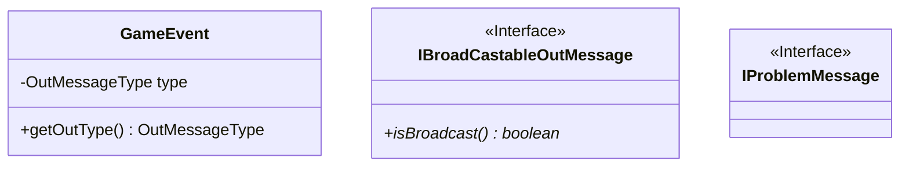

# Messages

Messages usually have to do with a Creature, an Item, a Command, Lewdness, Battle, Spells, Effects, or a group.

Messages could be broadcastable.
The subject matter should be easily retrivable by type and name.
Some messages relay errors about the subject matter.

GameEvent.java

## Problem messages

BadGoMessage.java
BadMessage.java
BadTargetSelectedMessage.java
CannotSpeakToMessage.java
FatalMessage.java
DuplicateUserMessage.java
HelpMessage.java

## Battle messages

BattleTurnMessage.java
FightOverMessage.java
JoinBattleMessage.java
MissMessage.java

## Cubed messages

CastingMessage.java
FleeMessage.java

## Item messages

DropOutMessage.java
EquipOutMessage.java
InventoryOutMessage.java
InteractOutMessage.java
NotPossessedMessage.java

## Creature messages

CreatureAffectedMessage.java
ReincarnateMessage.java
RenegadeAnnouncement.java

## Unsorted

LewdOutMessage.java
ListPlayersMessage.java
NewInMessage.java
NoUserMessage.java
ReinforcementsCall.java
RoomAffectedMessage.java
RoomEnteredOutMessage.java
SeeOutMessage.java
SomeoneLeftRoom.java
SpawnMessage.java
SpeakingMessage.java
SpellEntryMessage.java
SpellFizzleMessage.java
StartFightMessage.java
StatusOutMessage.java
TakeOutMessage.java
UnequipOutMessage.java
UseOutMessage.java
UserLeftMessage.java
WelcomeMessage.java

## Mermaid

