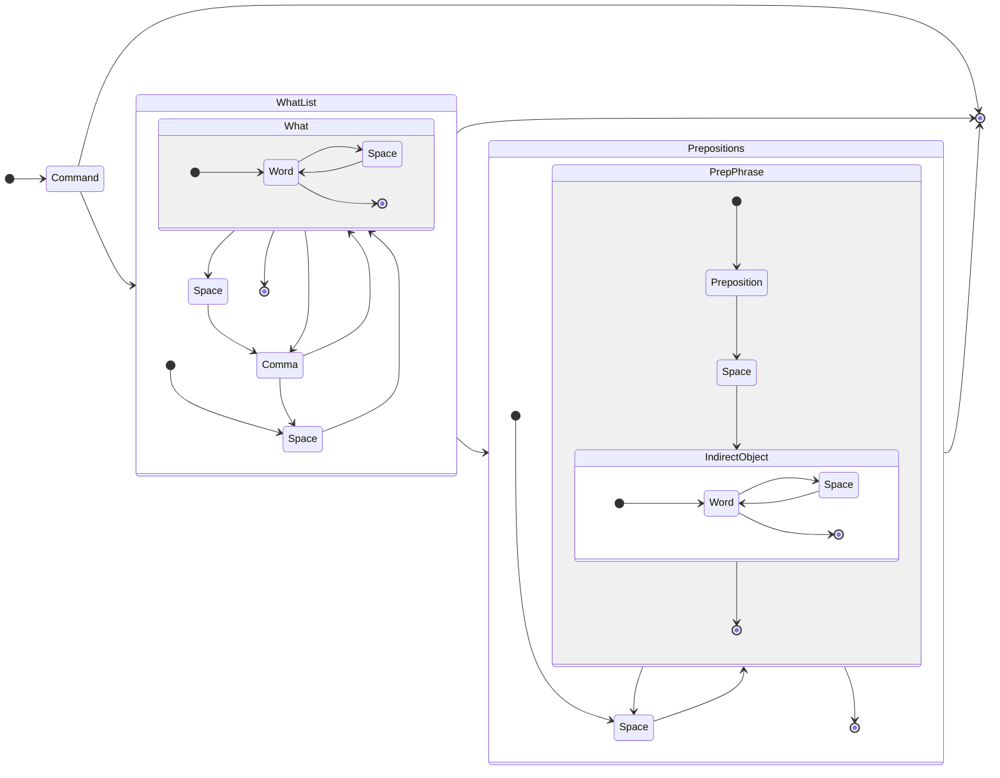

### Full definition

```mermaid
stateDiagram-v2
    direction LR
    [*] --> Command
    Command --> [*]

    state WhatList {
        direction TB
        state What {
            direction LR
            whatWord: Word
            [*] --> whatWord
            betweenWordSpace: Space
            whatWord --> betweenWordSpace
            betweenWordSpace --> whatWord
            whatWord --> [*]
        }
        interWhatSpace: Space
        [*] --> interWhatSpace
        interWhatSpace --> What
        preCommaSpace: Space
        What --> preCommaSpace
        preCommaSpace --> Comma
        
        What --> Comma
        Comma --> interWhatSpace
        Comma --> What
        What --> [*]
    }
    Command --> WhatList
    WhatList --> [*]

    state Prepositions{
        state PrepPhrase {
            [*] --> Preposition
            postPrepSpace: Space
            Preposition --> postPrepSpace
            state IndirectObject {
                direction LR
                ioWord: Word
                [*] --> ioWord
                betweenIoSpace: Space
                ioWord --> betweenIoSpace
                betweenIoSpace --> ioWord
                ioWord --> [*]
            }
            postPrepSpace --> IndirectObject
            IndirectObject --> [*]
        }
        interPhraseSpace: Space
        [*] --> interPhraseSpace
        interPhraseSpace --> PrepPhrase
        PrepPhrase --> interPhraseSpace
        PrepPhrase --> [*]
    }
    WhatList --> Prepositions
    Prepositions --> [*]


```