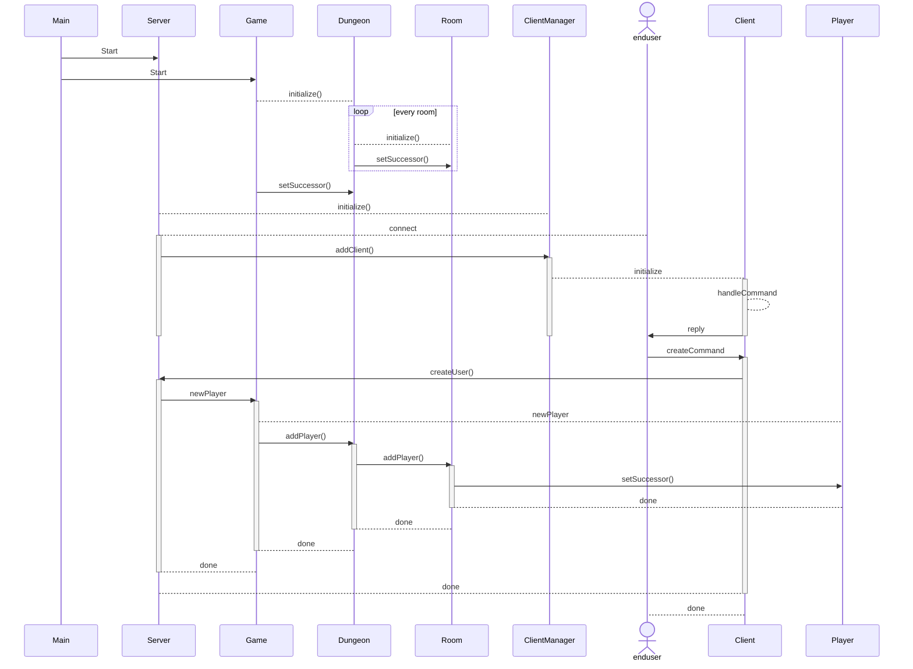

```mermaid
sequenceDiagram
    Main ->> Server: Start
    Main ->> Game: Start
    Game --> Dungeon: initialize()
    loop every room
        Dungeon --> Room: initialize()
        Dungeon ->> Room: setSuccessor()
    end
    Game ->> Dungeon: setSuccessor()
    Server --> ClientManager: initialize()
    actor enduser
    enduser --> Server: connect
    activate Server
    Server ->> ClientManager: addClient()
    activate ClientManager
    participant Client
    ClientManager --> Client: initialize
    activate Client
    Client --> Client: handleCommand
    Client ->> enduser: reply
    deactivate ClientManager
    deactivate Server
    deactivate Client

    enduser ->> Client: createCommand
    activate Client
        Client ->> Server: createUser()
        activate Server
            Server ->> Game: newPlayer
            activate Game
                Game --> Player: newPlayer
                Game ->> Dungeon: addPlayer()
                activate Dungeon
                    Dungeon ->> Room: addPlayer()
                    activate Room
                        Room ->> Player: setSuccessor()
                        Player --> Room: done
                    deactivate Room
                    Room --> Dungeon: done
                deactivate Dungeon
                Dungeon --> Game: done
            deactivate Game
            Game --> Server: done
        deactivate Server
        Server --> Client: done
    deactivate Client
    Client --> enduser: done

```